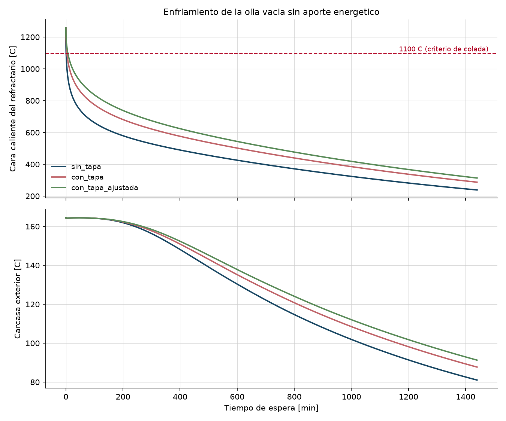
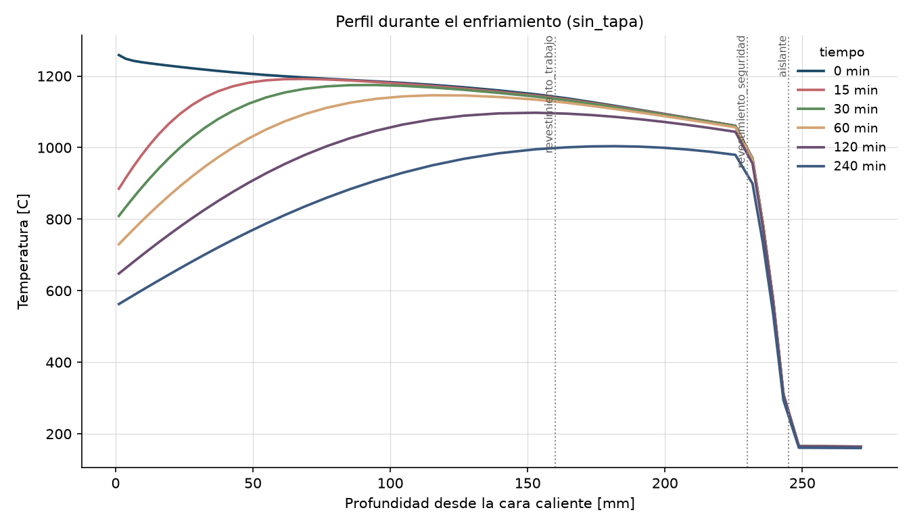
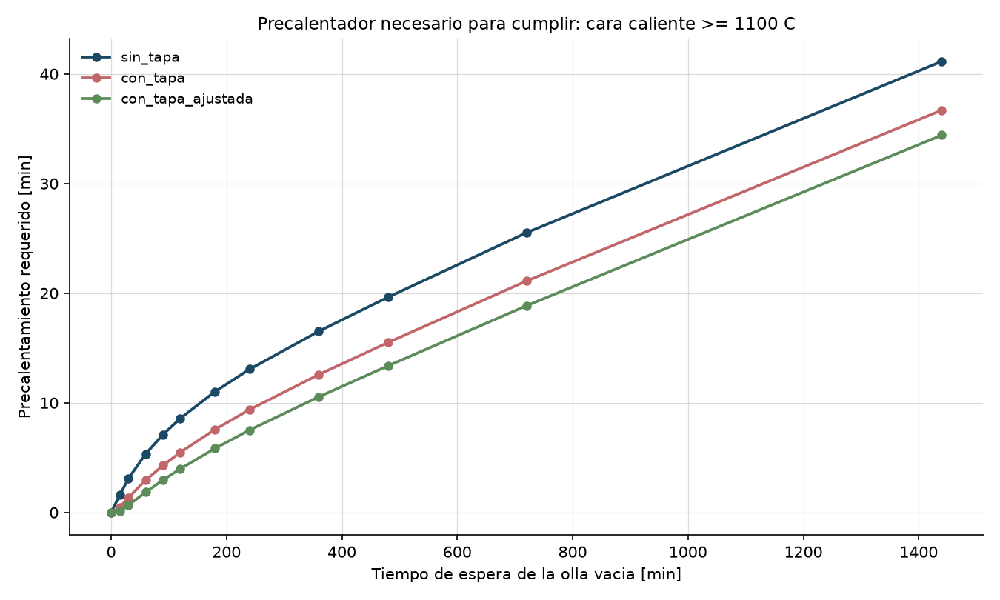
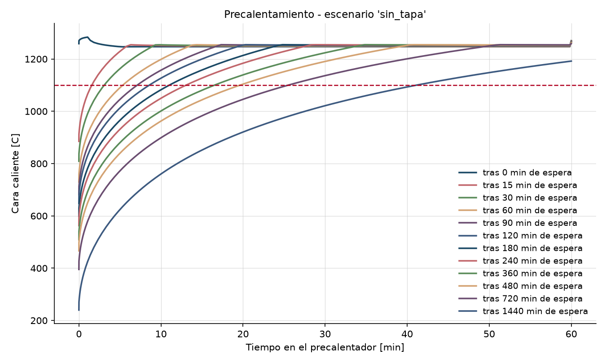

# Tiempo de precalentamiento requerido - criterio_solo_cara

_Generado 2026-08-24 22:06 UTC por `ladle-thermal`._

## Configuracion de la corrida

- **Olla**: olla_acero_150t (seccion 'wall', 40 celdas)
- **Espesores**: revestimiento_trabajo 160 mm (alumina_spinel_castable), revestimiento_seguridad 70 mm (high_alumina_brick_70), aislante 15 mm (microporous_board), carcasa 30 mm (carbon_steel_shell)
- **Estado de partida**: estado ciclico periodico tras 19 ciclos de 180 min (convergido)
- **Precalentador**: Precalentador 4.00 MW (horno bien agitado, llama adiabatica 1900 C, A=45.7 m2, h_conv=30, eps=0.70)
- **Criterio**: cara caliente >= 1100 C
- **Ambiente**: 35 C
- **Archivo de estudio**: /home/user/R-D-Agent/config/studies/criterio_solo_cara.yaml
- **Duracion del calculo**: 61 s

## Resultado: precalentamiento requerido

| Escenario | Espera vacia [min] | Cara caliente tras espera [C] | Media 25 mm [C] | Carcasa [C] | Precalentador requerido [min] | Criterio limitante |
|---|---:|---:|---:|---:|---:|---|
| sin_tapa | 0 | 1259 | 1237 | 164 | 0 | cara_caliente_C |
| sin_tapa | 15 | 870 | 1004 | 164 | 2 | cara_caliente_C |
| sin_tapa | 30 | 797 | 913 | 164 | 3 | cara_caliente_C |
| sin_tapa | 60 | 720 | 817 | 164 | 5 | cara_caliente_C |
| sin_tapa | 90 | 674 | 759 | 164 | 7 | cara_caliente_C |
| sin_tapa | 120 | 640 | 717 | 164 | 9 | cara_caliente_C |
| sin_tapa | 180 | 592 | 658 | 163 | 11 | cara_caliente_C |
| sin_tapa | 240 | 557 | 615 | 160 | 13 | cara_caliente_C |
| sin_tapa | 360 | 504 | 552 | 152 | 17 | cara_caliente_C |
| sin_tapa | 480 | 462 | 503 | 141 | 20 | cara_caliente_C |
| sin_tapa | 720 | 392 | 423 | 121 | 26 | cara_caliente_C |
| sin_tapa | 1440 | 239 | 252 | 81 | 41 | cara_caliente_C |
| con_tapa | 0 | 1259 | 1237 | 164 | 0 | cara_caliente_C |
| con_tapa | 15 | 985 | 1078 | 164 | 0 | cara_caliente_C |
| con_tapa | 30 | 915 | 1003 | 164 | 1 | cara_caliente_C |
| con_tapa | 60 | 838 | 915 | 164 | 3 | cara_caliente_C |
| con_tapa | 90 | 788 | 859 | 164 | 4 | cara_caliente_C |
| con_tapa | 120 | 751 | 817 | 164 | 5 | cara_caliente_C |
| con_tapa | 180 | 696 | 754 | 163 | 8 | cara_caliente_C |
| con_tapa | 240 | 655 | 708 | 161 | 9 | cara_caliente_C |
| con_tapa | 360 | 593 | 638 | 154 | 13 | cara_caliente_C |
| con_tapa | 480 | 544 | 583 | 145 | 15 | cara_caliente_C |
| con_tapa | 720 | 464 | 494 | 126 | 21 | cara_caliente_C |
| con_tapa | 1440 | 288 | 302 | 88 | 37 | cara_caliente_C |
| con_tapa_ajustada | 0 | 1259 | 1237 | 164 | 0 | cara_caliente_C |
| con_tapa_ajustada | 15 | 1040 | 1113 | 164 | 0 | cara_caliente_C |
| con_tapa_ajustada | 30 | 976 | 1048 | 164 | 1 | cara_caliente_C |
| con_tapa_ajustada | 60 | 900 | 967 | 164 | 2 | cara_caliente_C |
| con_tapa_ajustada | 90 | 850 | 913 | 164 | 3 | cara_caliente_C |
| con_tapa_ajustada | 120 | 812 | 871 | 164 | 4 | cara_caliente_C |
| con_tapa_ajustada | 180 | 754 | 808 | 163 | 6 | cara_caliente_C |
| con_tapa_ajustada | 240 | 710 | 759 | 161 | 8 | cara_caliente_C |
| con_tapa_ajustada | 360 | 643 | 686 | 155 | 11 | cara_caliente_C |
| con_tapa_ajustada | 480 | 590 | 627 | 147 | 13 | cara_caliente_C |
| con_tapa_ajustada | 720 | 502 | 532 | 129 | 19 | cara_caliente_C |
| con_tapa_ajustada | 1440 | 314 | 329 | 91 | 34 | cara_caliente_C |

### Lectura rapida

- **sin_tapa**: entre 0 y 41 min de precalentador segun la espera (0-1440 min).
- **con_tapa**: entre 0 y 37 min de precalentador segun la espera (0-1440 min).
- **con_tapa_ajustada**: entre 0 y 34 min de precalentador segun la espera (0-1440 min).

## Figuras

**Enfriamiento de la olla vacia**

**Perfil de temperatura en el espesor**

**Precalentamiento requerido**

**Curvas de precalentamiento**

## Limitaciones de esta corrida

- El modelo es 1D radial: no representa gradientes axiales, la linea de escoria, la zona de impacto ni el fondo/buza. Los tiempos son de la PARED.
- Las propiedades de los materiales son valores tipicos de literatura, no fichas tecnicas del refractario instalado. Ver `docs/propiedades_materiales.md`.
- El factor de intercambio radiativo de la olla vacia y `eps_eff` del precalentador son los dos parametros que mas mueven el resultado y ambos requieren calibracion contra una curva medida (termopar de carcasa o pirometro de cara caliente).
- No se modela el desgaste ni el adelgazamiento del revestimiento: una olla al final de campana tiene menos espesor de trabajo y se comporta distinto.
