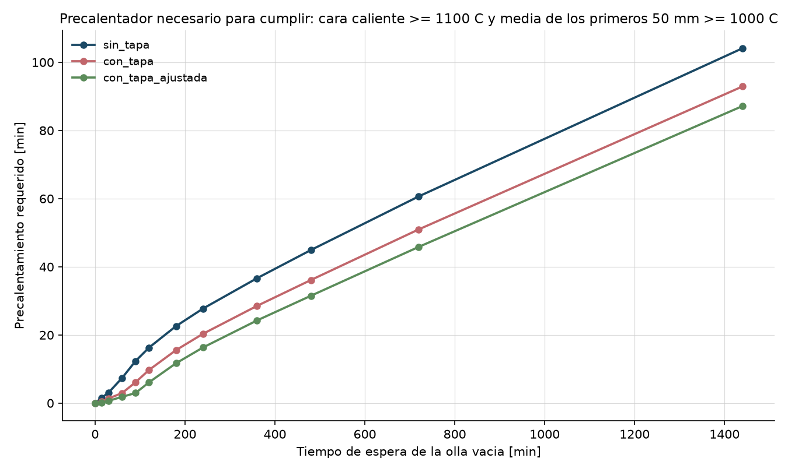
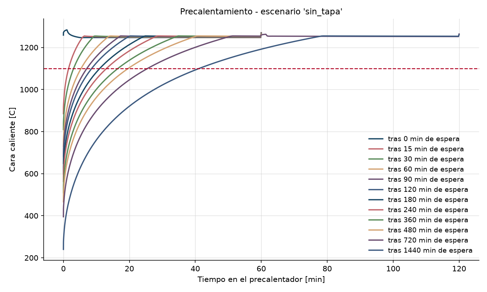

# Tiempo de precalentamiento requerido - precalentamiento_base

_Generado 2026-08-24 21:55 UTC por `ladle-thermal`._

## Configuracion de la corrida

- **Olla**: olla_acero_150t (seccion 'wall', 40 celdas)
- **Espesores**: revestimiento_trabajo 160 mm (alumina_spinel_castable), revestimiento_seguridad 70 mm (high_alumina_brick_70), aislante 15 mm (microporous_board), carcasa 30 mm (carbon_steel_shell)
- **Estado de partida**: estado ciclico periodico tras 19 ciclos de 180 min (convergido)
- **Precalentador**: Precalentador 4.00 MW (horno bien agitado, llama adiabatica 1900 C, A=45.7 m2, h_conv=30, eps=0.70)
- **Criterio**: cara caliente >= 1100 C y media de los primeros 50 mm >= 1000 C
- **Ambiente**: 35 C
- **Archivo de estudio**: /home/user/R-D-Agent/config/studies/precalentamiento_base.yaml
- **Duracion del calculo**: 65 s

## Resultado: precalentamiento requerido

| Escenario | Espera vacia [min] | Cara caliente tras espera [C] | Media 25 mm [C] | Carcasa [C] | Precalentador requerido [min] | Criterio limitante |
|---|---:|---:|---:|---:|---:|---|
| sin_tapa | 0 | 1259 | 1225 | 164 | 0 | cara_caliente_C |
| sin_tapa | 15 | 870 | 1081 | 164 | 2 | cara_caliente_C |
| sin_tapa | 30 | 797 | 999 | 164 | 3 | cara_caliente_C |
| sin_tapa | 60 | 720 | 898 | 164 | 7 | media_50mm_C |
| sin_tapa | 90 | 674 | 834 | 164 | 12 | media_50mm_C |
| sin_tapa | 120 | 640 | 788 | 164 | 16 | media_50mm_C |
| sin_tapa | 180 | 592 | 720 | 163 | 23 | media_50mm_C |
| sin_tapa | 240 | 557 | 671 | 160 | 28 | media_50mm_C |
| sin_tapa | 360 | 504 | 599 | 152 | 37 | media_50mm_C |
| sin_tapa | 480 | 462 | 543 | 141 | 45 | media_50mm_C |
| sin_tapa | 720 | 392 | 452 | 121 | 61 | media_50mm_C |
| sin_tapa | 1440 | 239 | 265 | 81 | 104 | media_50mm_C |
| con_tapa | 0 | 1259 | 1225 | 164 | 0 | cara_caliente_C |
| con_tapa | 15 | 985 | 1129 | 164 | 0 | cara_caliente_C |
| con_tapa | 30 | 915 | 1064 | 164 | 1 | cara_caliente_C |
| con_tapa | 60 | 838 | 978 | 164 | 3 | cara_caliente_C |
| con_tapa | 90 | 788 | 920 | 164 | 6 | media_50mm_C |
| con_tapa | 120 | 751 | 875 | 164 | 10 | media_50mm_C |
| con_tapa | 180 | 696 | 808 | 163 | 16 | media_50mm_C |
| con_tapa | 240 | 655 | 757 | 161 | 20 | media_50mm_C |
| con_tapa | 360 | 593 | 681 | 154 | 29 | media_50mm_C |
| con_tapa | 480 | 544 | 621 | 145 | 36 | media_50mm_C |
| con_tapa | 720 | 464 | 523 | 126 | 51 | media_50mm_C |
| con_tapa | 1440 | 288 | 317 | 88 | 93 | media_50mm_C |
| con_tapa_ajustada | 0 | 1259 | 1225 | 164 | 0 | cara_caliente_C |
| con_tapa_ajustada | 15 | 1040 | 1151 | 164 | 0 | cara_caliente_C |
| con_tapa_ajustada | 30 | 976 | 1096 | 164 | 1 | cara_caliente_C |
| con_tapa_ajustada | 60 | 900 | 1020 | 164 | 2 | cara_caliente_C |
| con_tapa_ajustada | 90 | 850 | 965 | 164 | 3 | cara_caliente_C |
| con_tapa_ajustada | 120 | 812 | 922 | 164 | 6 | media_50mm_C |
| con_tapa_ajustada | 180 | 754 | 856 | 163 | 12 | media_50mm_C |
| con_tapa_ajustada | 240 | 710 | 805 | 161 | 16 | media_50mm_C |
| con_tapa_ajustada | 360 | 643 | 726 | 155 | 24 | media_50mm_C |
| con_tapa_ajustada | 480 | 590 | 664 | 147 | 31 | media_50mm_C |
| con_tapa_ajustada | 720 | 502 | 561 | 129 | 46 | media_50mm_C |
| con_tapa_ajustada | 1440 | 314 | 344 | 91 | 87 | media_50mm_C |

### Lectura rapida

- **sin_tapa**: entre 0 y 104 min de precalentador segun la espera (0-1440 min).
- **con_tapa**: entre 0 y 93 min de precalentador segun la espera (0-1440 min).
- **con_tapa_ajustada**: entre 0 y 87 min de precalentador segun la espera (0-1440 min).

## Figuras

**Enfriamiento de la olla vacia**

**Perfil de temperatura en el espesor**

**Precalentamiento requerido**

**Curvas de precalentamiento**

## Limitaciones de esta corrida

- El modelo es 1D radial: no representa gradientes axiales, la linea de escoria, la zona de impacto ni el fondo/buza. Los tiempos son de la PARED.
- Las propiedades de los materiales son valores tipicos de literatura, no fichas tecnicas del refractario instalado. Ver `docs/propiedades_materiales.md`.
- El factor de intercambio radiativo de la olla vacia y `eps_eff` del precalentador son los dos parametros que mas mueven el resultado y ambos requieren calibracion contra una curva medida (termopar de carcasa o pirometro de cara caliente).
- No se modela el desgaste ni el adelgazamiento del revestimiento: una olla al final de campana tiene menos espesor de trabajo y se comporta distinto.
